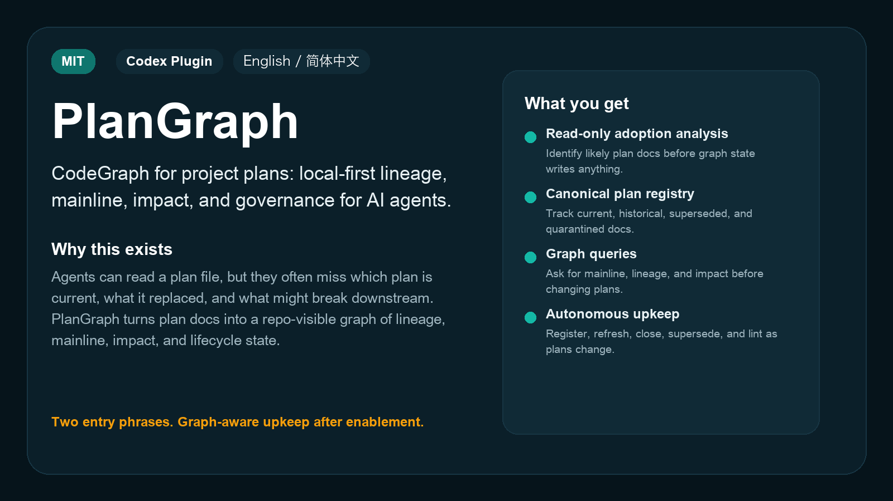
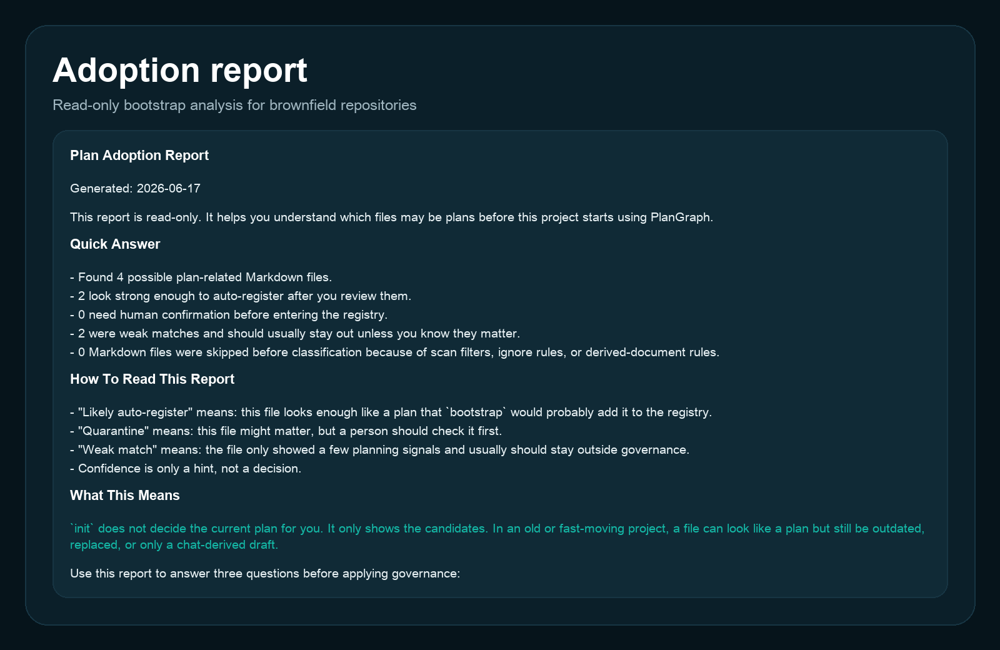
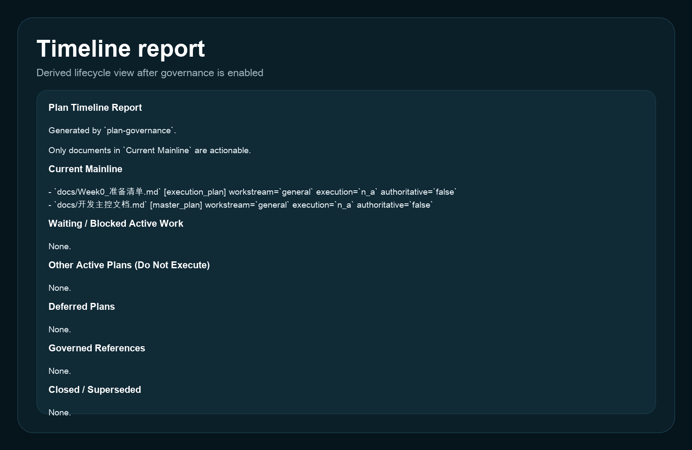

<p align="center">
  
</p>

<h1 align="center">PlanGraph</h1>

<p align="center">
  <strong>面向项目计划的 CodeGraph：为 AI Agent 提供本地优先的计划谱系、主线、影响面和治理能力。</strong>
</p>

<p align="center">
  <a href="./README.md">English</a> ·
  <a href="#30-秒开始">30 秒开始</a> ·
  <a href="#真实产物">真实产物</a> ·
  <a href="./plangraph%20%E5%BC%80%E5%8F%91%E8%AE%A1%E5%88%92.md">开发计划</a>
</p>

<p align="center">
  <a href="./LICENSE"></a>
  
  
</p>

<p align="center">
  
</p>

## 为什么会有 PlanGraph

AI 很容易读懂一份计划文档，但它经常不知道哪份计划才是当前主线，哪份已经被替代，哪份 closeout 解释了旧方向为什么停止，以及新计划会影响哪些下游文档。

这和 CodeGraph 解决代码理解问题的方式很像。CodeGraph 不让 AI 自己 grep 全仓，而是给它一个本地符号图谱。PlanGraph 把这个思路用在项目计划上。

PlanGraph 把分散的 roadmap、执行清单、closeout、状态文档、决策和证据材料变成仓库内可见的计划图谱。Registry 仍然是真源；图谱查询提供 lineage、当前主线、影响面、冲突检查和 AI 上下文。

## 它解决什么

| 问题 | PlanGraph 做什么 |
|---|---|
| 多份文档都像当前计划 | 维护带生命周期和权威字段的 canonical registry |
| 新计划替代旧计划，但关系没有记录 | 维护替代关系和谱系链 |
| Agent 总是依赖聊天上下文 | 把计划状态变成仓库内可见事实 |
| 当前工作、历史 closeout、未来草案混在一起 | 区分可执行主线、deferred、superseded、closed 和 governed references |
| Agent 准备修改计划但不了解历史影响 | 提供 lineage、impact、conflict 和 context 查询 |

## 30 秒开始

### 方式一：用 `npx skills` 安装（推荐）

[`skills`](https://github.com/vercel-labs/skills) 是开源的 Agent Skill 包管理器，可以检测支持的 agent 环境，并把 skill 安装到合适位置。

```bash
npx skills add cici-uu8/PlanGraph
```

### 方式二：让 Codex 自动安装

在 Codex 里说：

```text
用 $skill-installer 从 https://github.com/cici-uu8/PlanGraph 安装这个 skill。
```

如果新 skill 没有立即出现，重启 Codex。

### 第一次使用

安装后先做只读接入分析：

```text
用 $plangraph 分析这个仓库。
```

只有当你认可扫描结果时，再启用 PlanGraph：

```text
用 $plangraph 启用计划图谱。
```

| 入口 | 含义 |
|---|---|
| `用 $plangraph 分析这个仓库。` | 只读扫描。会写 adoption report，但不创建 registry，也不修改 `AGENTS.md`。 |
| `用 $plangraph 启用计划图谱。` | 创建治理文件，并默认安装 managed `AGENTS.md` block，除非你明确拒绝。 |

## 当前能力

PlanGraph 当前先聚焦确定性基础：

- brownfield 接入分析，并明确展示扫描范围和范围外 Markdown 数量
- canonical plan registry
- active、deferred、superseded、closed、rejected、archived、unknown 等生命周期状态
- `supersedes` / `superseded_by` 关系
- 当前主线分离
- 主动 register / refresh / close / supersede 维护
- registry 和生命周期一致性 lint
- mainline、lineage、impact、确定性 conflicts、显式 Markdown 正文链接和 repo 外部引用的内存图谱查询
- 对有价值的外部 Markdown 引用做 dry-run / apply 本地化接入
- 本地 SQLite 索引，用于 status、sync、FTS query 和稳定读取缓存
- 只读 stdio MCP server，提供 status、mainline、query、lineage、impact、context、conflicts 和 body-links 工具，并补齐 Codex 安装/卸载和 workspace root 发现
- 显式 semantic 软边抽取，只展示高置信、跨 workstream、registry 无直接硬关系的相似计划

SQLite、MCP 和 semantic edges 都是派生层。Registry 仍是真源；普通 `query` 保持确定性文本搜索，不默认混入 semantic 结果，语义软边只通过显式 `semantic` 命令输出。

现在 SQLite query 会保留英文长词场景下的 FTS 主路径，但当 FTS 返回 0 结果时，会自动退回 SQLite `LIKE '%term%'` 子串匹配。这个回退主要是为中文短词和子串检索准备的，避免中文用户把“搜不到”误解成“仓库里没有”。

## 发布边界

当前稳定公开能力是确定性的 PlanGraph 工作流：adoption scan、bootstrap、registry 维护、生命周期 lint，以及 mainline、lineage、impact、conflicts、body links、external references 等图谱查询。

SQLite、MCP 和 semantic soft edges 是本地实验性的产品底座层。它们用于验证更成熟的 CodeGraph-like 体验，但还不应该被当成稳定公开 API。尤其是 semantic 输出必须显式且克制：真实验证仓库里，过滤后从 42 条原始 overlap 候选降到 1 条 registry-zero-relation、跨 workstream 的增量边。

## 启用后如何工作

一旦仓库里存在 `docs/plan_registry.md`，这个仓库就被视为已启用 PlanGraph。

常规情况下，你不需要说“注册这份计划”或“关闭那份计划”。当新计划文档被创建时，skill 应该主动注册或刷新图谱状态。当新计划替代旧计划时，它应该建立替代关系并把旧计划标记为 superseded。当计划结束且没有后继时，它应该关闭计划，而不是继续改历史正文。

真正存在歧义时，skill 应该先问用户：

- 多份文档都可能是当前主线
- 新文档可能是替代，也可能是并行工作流
- 某些目录或文档类型可能需要排除
- 软图谱关系只是推测，不是 registry 事实

正确体验不是让用户手动跑一堆命令，而是：用户完成接入和启用，之后 agent 在正常项目工作中主动维护计划状态并查询 PlanGraph。

## 典型工作流

启用 PlanGraph 后，用户可以继续自然描述项目工作：

```text
为 retrieval 评测工作流创建一份新的执行计划。
```

agent 创建计划文档，并主动注册它。

```text
这份新计划替代旧的 Week 2 retrieval 计划。
```

agent 建立 `supersedes` / `superseded_by` 关系。

```text
修改当前计划前，先检查它的谱系、影响面和正文链接。
```

agent 查询 PlanGraph，再决定当前事实来源。

如果计划链接到另一个本地 checkout 或 worktree 里的文档，PlanGraph 会把它报告为 `external_reference`，并显示目标路径、文件是否存在、是否命中 configured trusted roots。外部引用默认只是上下文，不会变成当前 repo 的图谱边，也不会变成 registry 事实。

如果这些外部文档其实是当前 repo 复制时漏掉的计划资料，agent 可以先运行 external-reference adoption dry run，再把有价值的 Markdown 引用复制进当前 repo，重写成相对链接，并把导入文档注册为受治理但不可执行的上下文。

## 真实产物

下面展示的是一组简化示例，用来帮助你快速理解产物长什么样。

### 只读接入分析报告

adoption scan 会在正式启用前生成一份可读报告，帮助人判断哪些历史文件是当前计划、历史计划、弱匹配，或者需要隔离确认。
它也会报告有多少 Markdown 位于当前扫描范围内、多少 Markdown 在范围外未被检查，避免用户误以为 PlanGraph 已经看过全仓所有文档。

<p align="center">
  
</p>

### Canonical registry

启用后，registry 会成为计划生命周期状态的可见事实来源。

<p align="center">
  
</p>

### 时间线视图

timeline report 从 registry 派生，让人和 agent 都能快速区分当前可执行主线、其他受治理但不可执行的计划、参考文档、closed、superseded 和 quarantine 文档。

<p align="center">
  
</p>

示例 Markdown 输出和 GitHub Actions lint 模板见 [`examples/`](./examples/)。

## 在 Codex 中启用 MCP

PlanGraph 现在提供一个收敛的第一宿主 MCP 路径，先支持 Codex。

把本地 stdio server 安装进 Codex：

```bash
python3 scripts/plan_governance.py install --repo-root "$(pwd)"
```

查看 Codex 当前会使用什么配置：

```bash
python3 scripts/plan_governance.py discover-mcp --repo-root "$(pwd)"
```

移除 Codex 里的 MCP 条目：

```bash
python3 scripts/plan_governance.py uninstall
```

这条安装路径是故意收窄的：

- 只在 Codex 里配置一个全局 `plangraph` MCP entry，不为每个仓库单独写静态 server
- server 通过 MCP `rootUri` / `workspaceFolders` 自动发现当前 repo root
- 对不能传 workspace metadata 的宿主或脚本，仍可用 `PLANGRAPH_REPO_ROOT` 做手工覆盖
- install / uninstall 后需要重启 Codex，让 MCP 工具列表刷新

## 适用边界与退出机制

PlanGraph 不是项目管理 SaaS，不是任务追踪器，不是计划生成器，也不是 LangGraph 类 workflow runtime。

适合使用的场景：

- 仓库里有项目级计划文档
- 存在多份当前或历史计划
- 多个 agent 需要稳定的计划生命周期和影响面事实来源

不适合强制启用的场景：

- 只有 scratch notes
- 只有聊天记录
- 没有项目级计划文档

如果只想停止 `AGENTS.md` 的规则注入，同时保留图谱历史：

```text
用 $plangraph 移除这个仓库里的 managed AGENTS block。
```

这只会移除 managed block，不会删除 registry、报告或配置文件，因为这些文件可能已经承载项目历史。

## 宿主兼容性

这个项目首先面向 Codex skills 和 Codex plugin 分发。

| 宿主 | 状态 | 说明 |
|---|---|---|
| Codex | 支持 | 使用 `SKILL.md`、本地脚本、`AGENTS.md` 和 `.codex-plugin/plugin.json` |
| 兼容 Codex skills 的宿主 | 可能支持 | 需要支持 skill 调用和本地脚本执行 |
| Claude Code 或其他 agent 宿主 | 需要适配 | 不能假设 `$plangraph`、`AGENTS.md` 或 plugin metadata 自动生效 |

## 仓库结构

```text
plangraph/
├── .codex-plugin/plugin.json
├── README.md
├── README.zh-CN.md
├── SKILL.md
├── agents/openai.yaml
├── assets/
├── examples/
├── references/
├── scripts/
├── skills/plangraph/SKILL.md
├── templates/
└── tests/
```

`README.md` 是公开项目入口。`SKILL.md` 是 agent 执行指南。`skills/plangraph/SKILL.md` 是 plugin 分发入口使用的包装层。

## Star History

<picture>
  <source media="(prefers-color-scheme: dark)" srcset="https://api.star-history.com/svg?repos=cici-uu8/PlanGraph&type=Date&theme=dark" />
  <source media="(prefers-color-scheme: light)" srcset="https://api.star-history.com/svg?repos=cici-uu8/PlanGraph&type=Date" />
  
</picture>

## 许可证与贡献

本项目采用 [MIT License](./LICENSE)。

在公开 API 和分发路径稳定前，issue 和 PR 建议优先聚焦：

- 宿主兼容性问题
- 图谱查询正确性
- 计划分类误判或漏判
- 生命周期和谱系边界案例
- README、examples 和安装说明清晰度
